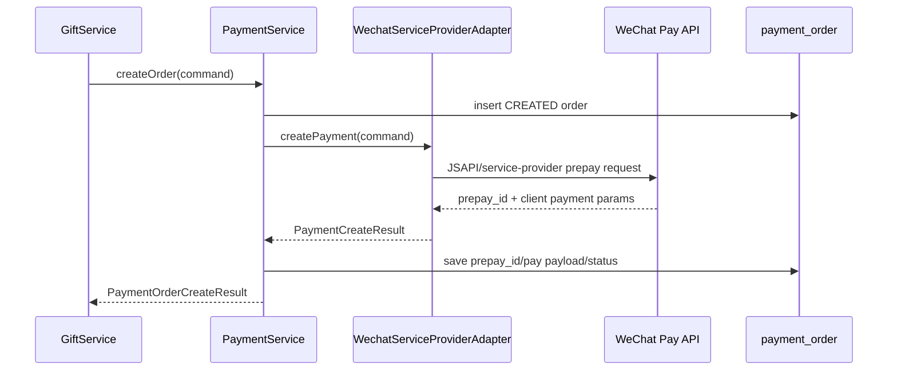
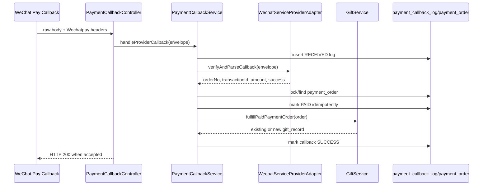

# P1-A Payment Production Design

## Purpose

This document freezes the technical design for P1-A payment production hardening before implementation.

The design starts from the accepted MVP payment boundary:

- Business modules create payment orders through `PaymentService`.
- Provider-specific behavior stays behind `PaymentAdapter`.
- `PaymentCallbackService` owns verification handoff, order marking and business fulfillment.
- Online gift and onsite QR share the same `payment_order`, `gift_record`, `favor_entry`, callback and broadcast path.
- Mock provider remains the local acceptance provider.

P1-A adds production-ready WeChat service-provider support without rewriting the accepted MVP flow.

## External References

- WeChat Pay Java SDK official repository: <https://github.com/wechatpay-apiv3/wechatpay-java>
- WeChat Pay Java SDK Maven artifact: <https://central.sonatype.com/artifact/com.github.wechatpay-apiv3/wechatpay-java>
- WeChat Pay official SDK/tooling page: <https://pay.wechatpay.cn/doc/v3/merchant/4013360972>
- WeChat Pay notification signature verification and decryption guide: <https://pay.wechatpay.cn/doc/v3/merchant/4012084308>

The SDK should be preferred for request signing, response validation, notification parsing and resource decryption. Direct hand-written cryptography should be limited to glue code that cannot be covered by the SDK.

## Current Code Baseline

Current payment files:

- `PaymentAdapter`
- `PaymentService`
- `PaymentCallbackService`
- `MockPaymentAdapter`
- `WechatServiceProviderAdapter`
- `PaymentProviderProperties`
- `PaymentCallbackController`
- `payment_order`
- `payment_callback_log`

Remaining gaps:

- WeChat JSAPI/service-provider prepay is implemented behind `WechatPartnerJsapiClient`, but it has not been verified against a real merchant sandbox/account.
- WeChat callback verification and decryption are implemented behind `WechatNotificationParserClient`, but they have not been verified with real merchant callback samples.
- `payment_order.provider_trade_no` is overloaded; WeChat needs separate tracking for prepay ID and final transaction ID.

## Target Architecture

### Payment Creation Flow



Key design point: insert the local `payment_order` before calling WeChat so the callback can always find an order by `out_trade_no`.

### Callback Flow



## Interface Changes

### Add `PaymentCallbackEnvelope`

Add a provider-neutral envelope so callbacks can carry raw body, headers and compatibility fields.

Fields:

- `PaymentProvider provider`
- `String rawBody`
- `Map<String, String> headers`
- `String signature`
- `String requestId`

Usage:

- Mock provider maps the old JSON request into an envelope with `signature`.
- WeChat provider reads `Wechatpay-Timestamp`, `Wechatpay-Nonce`, `Wechatpay-Signature`, `Wechatpay-Serial` and request body from the envelope.

### Update `PaymentAdapter`

Target interface:

```java
public interface PaymentAdapter {
    PaymentProvider provider();
    PaymentCreateResult createPayment(PaymentCreateCommand command);
    PaymentCallbackResult verifyAndParseCallback(PaymentCallbackEnvelope envelope);
}
```

Compatibility:

- The generic `/api/payments/callbacks` mock endpoint can build an envelope from the existing DTO.
- The WeChat endpoint should not require the existing JSON wrapper.

### Extend `PaymentCreateCommand`

Add fields needed by real provider creation:

- `String notifyUrl`
- `String clientIp`
- `String appId`
- `String subAppId`
- `String subMerchantId`
- `String payerOpenIdType`

`payerOpenIdType` should distinguish whether the incoming OpenID is under service-provider app context or sub-merchant app context. The exact WeChat field mapping must be verified against the selected service-provider product mode before implementation.

### Extend `PaymentCreateResult`

Add explicit fields:

- `String prepayId`
- `String providerTradeNo`
- `String payPayload`
- `LocalDateTime expiresAt`

For WeChat:

- `prepayId` stores the prepay token returned by order creation.
- `providerTradeNo` remains empty until payment success callback returns final transaction ID.
- `payPayload` returns miniapp/H5 client payment parameters.

## Controller Design

### Keep Mock Callback Endpoint

Current endpoint remains for local acceptance:

```text
POST /api/payments/callbacks
```

Purpose:

- Mock callback tests.
- Local callback failure handling.
- Existing `local-acceptance.sh` compatibility.

### Add WeChat Callback Endpoint

Add:

```text
POST /api/payments/callbacks/wechat-service-provider
```

Behavior:

- Read raw request body as `String`.
- Read required WeChat headers.
- Build `PaymentCallbackEnvelope`.
- Call `PaymentCallbackService.handleProviderCallback(envelope)`.
- Return HTTP `200` only when callback is accepted for processing.
- Return non-2xx when signature/decryption fails or the callback cannot be safely recorded.

The controller should not parse decrypted business fields directly. That stays in `WechatServiceProviderAdapter`.

## WeChat Adapter Design

### Configuration

Extend `payment.providers.WECHAT_SERVICE_PROVIDER`:

- `enabled`
- `spMerchantId`
- `spAppId`
- `subMerchantId`
- `subAppId`
- `merchantSerialNo`
- `privateKeyPath` or `privateKeyPem`
- `apiV3Key`
- `notifyUrl`
- `certificateMode`
- `platformCertificatePath`
- `wechatPayPublicKeyId`
- `wechatPayPublicKeyPath`

Notes:

- Prefer filesystem/secret-manager references over raw private keys in environment variables.
- Do not expose private key, API v3 key or callback secrets through admin APIs.
- Admin provider status may expose only masked IDs and boolean `configured` fields.

### Payment Creation

Implemented through the WeChat Pay Java SDK `partnerpayments.jsapi.JsapiServiceExtension` and a local `WechatPartnerJsapiClient` boundary so business services never depend on SDK classes.

Adapter responsibilities:

- Build service-provider JSAPI prepay request.
- Use local `orderNo` as provider `out_trade_no`.
- Use amount in fen; validate conversion from `BigDecimal`.
- Use configured notify URL.
- Return client payment parameters in `payPayload`.
- Store `prepayId` separately from final transaction ID.
- Map payer OpenID to `sub_openid` when `subAppId` is configured; otherwise map to `sp_openid`.

### Callback Verification And Parse

Adapter responsibilities:

- Build SDK notification `RequestParam` from raw body and `Wechatpay-*` headers.
- Verify signature and decrypt notification resource through WeChat Pay Java SDK `NotificationParser`.
- Parse decrypted transaction payload into `Transaction`.
- Return provider event metadata for callback logs.
- Mark only `trade_state=SUCCESS` as a successful paid callback.
- Convert WeChat amount from fen to yuan before local amount comparison.

Implementation note:

- The generic mock callback endpoint remains JSON/HMAC based for local acceptance.
- The WeChat callback endpoint accepts raw body and request headers, then stores headers/raw body/decrypted body/event metadata in `payment_callback_log`.

- Verify request signature using official SDK verifier/parser.
- Decrypt notification resource with API v3 key.
- Parse decrypted resource into a provider-neutral `PaymentCallbackResult`.
- Map provider `out_trade_no` to local `orderNo`.
- Map final WeChat transaction ID to `providerTradeNo`.
- Map total amount from fen to `BigDecimal` yuan.
- Return `success=false` for non-success payment-state notifications.

The adapter should throw validation exceptions for signature/decryption failure so `PaymentCallbackService` records `verifyStatus=FAILED` and `processStatus=FAILED`.

## Database Changes

### `payment_order`

Add:

- `prepay_id VARCHAR(128) NULL`
- `pay_payload MEDIUMTEXT NULL`
- `provider_status VARCHAR(64) NULL`
- `expires_at DATETIME NULL`
- `notify_url VARCHAR(500) NULL`

Keep:

- `provider_trade_no` for final transaction ID.
- `order_no` as local merchant order number / WeChat `out_trade_no`.

Recommended indexes:

- `UNIQUE KEY uk_payment_provider_trade (provider, provider_trade_no)` with nullable handling considered by MySQL behavior.
- `INDEX idx_payment_provider_status (provider, provider_status)`

### `payment_callback_log`

Add:

- `request_id VARCHAR(128) NULL`
- `provider_event_id VARCHAR(128) NULL`
- `provider_serial_no VARCHAR(128) NULL`
- `headers MEDIUMTEXT NULL`
- `decrypted_body MEDIUMTEXT NULL`
- `event_type VARCHAR(128) NULL`
- `resource_type VARCHAR(128) NULL`

Recommended index:

- `INDEX idx_payment_callback_event (provider, provider_event_id)`

Do not store secrets or decrypted data that contains sensitive user information beyond what is needed for audit. If the decrypted body is too sensitive, store a filtered JSON projection instead.

## Idempotency Strategy

The current `GiftService.fulfillPaidPaymentOrder` already returns an existing gift record by `payment_order_id`, which protects the gift/favor/broadcast path from repeated fulfillment.

P1 should additionally harden:

1. Lock or atomically update `payment_order` by `order_no` during callback handling.
2. If `pay_status=PAID`, do not update paid fields destructively.
3. If `provider_trade_no` already exists and differs from callback transaction ID, mark callback `FAILED`.
4. If callback event ID was already processed, mark duplicate callback `IGNORED` or `SUCCESS_DUPLICATE`.
5. Add a unique or defensive query around `payment_callback_log.provider_event_id` when provider supplies stable event ID.

Expected outcomes:

- Replayed valid callback does not duplicate `gift_record`.
- Replayed valid callback does not duplicate `favor_entry`.
- Replayed valid callback does not duplicate `broadcast_log`.
- Replayed valid callback remains visible in callback logs.

## Failure Handling

Use existing status model:

- `verifyStatus=FAILED`, `processStatus=FAILED`: signature, certificate, timestamp, nonce or decryption failure.
- `verifyStatus=VERIFIED`, `processStatus=FAILED`: order not found, amount mismatch, transaction ID conflict or unsupported scene.
- `verifyStatus=VERIFIED`, `processStatus=IGNORED`: verified non-success event.
- `verifyStatus=VERIFIED`, `processStatus=SUCCESS`: paid and fulfilled.

Add operation logs:

- `CALLBACK_SIGNATURE_FAILED`
- `CALLBACK_DECRYPT_FAILED`
- `CALLBACK_AMOUNT_MISMATCH`
- `CALLBACK_TRANSACTION_CONFLICT`
- `CALLBACK_DUPLICATE`
- `CALLBACK_SUCCESS`

## Testing Strategy

### Unit Tests

- Mock adapter still verifies HMAC and parses local callback.
- WeChat adapter rejects missing headers.
- WeChat adapter rejects invalid signature.
- WeChat adapter rejects decrypt failure.
- WeChat adapter maps decrypted success notification into `PaymentCallbackResult`.
- WeChat adapter maps non-success notification to `success=false`.

### Service Tests

- `PaymentService.createOrder` persists local order before provider creation.
- Provider creation failure marks or reports local order consistently.
- Valid callback marks order as `PAID`.
- Amount mismatch records failed callback and does not fulfill gift.
- Missing order records failed callback.
- Replayed callback does not duplicate gift/favor/broadcast rows.
- Existing mock local acceptance flow still passes.

### Integration/Sandbox Tests

- WeChat sandbox or staging prepay request returns client payment parameters.
- Official callback sample or sandbox callback verifies and decrypts.
- Admin provider status masks secrets.
- `local-acceptance.sh` passes with `PAYMENT_DEFAULT_PROVIDER=MOCK`.

## Implementation Batches

### P1-A1: Interface And Schema Preparation

Status: Done.

Delivered:

- Added `PaymentCallbackEnvelope`.
- Extended `PaymentAdapter` to verify callbacks through the envelope.
- Added raw WeChat service-provider callback endpoint shape.
- Added nullable payment provider preparation fields in Flyway `V16`.
- Extended `PaymentOrder` and `PaymentCallbackLog` entities.
- Kept existing mock JSON callback compatibility.
- Added Mock adapter envelope/signature tests.

Verification:

- `mvn -q test`
- `bash deploy/scripts/local-acceptance.sh`
- Latest accepted run: `/var/folders/4b/gwp_mz5x1sb7_9rq71ydgnpw0000gn/T//yanxitong-local-acceptance-20260622164309/summary.json`

### P1-A2: WeChat SDK Wiring

Status: Done.

Delivered:

- Added WeChat Pay Java SDK dependency `com.github.wechatpay-apiv3:wechatpay-java`.
- Extended provider configuration fields for service-provider, sub-merchant, private key, API v3 key, notify URL and certificate mode.
- Implemented `WechatPayClientFactory` for SDK config preparation.
- Added support for `AUTO`, `PLATFORM_CERTIFICATE` and `PUBLIC_KEY` certificate modes.
- Extended admin provider status with non-secret readiness flags and masked IDs.
- Added disabled/misconfigured provider tests.

Verification:

- `mvn -q test`
- `bash deploy/scripts/local-acceptance.sh`
- Latest accepted run: `/var/folders/4b/gwp_mz5x1sb7_9rq71ydgnpw0000gn/T//yanxitong-local-acceptance-20260622165147/summary.json`

### P1-A3: WeChat Prepay

- Implement `WechatServiceProviderAdapter.createPayment`.
- Return `prepayId` and `payPayload`.
- Save prepay fields to `payment_order`.
- Add tests with mocked SDK/client boundary.

### P1-A4: WeChat Callback

- Add raw WeChat callback endpoint.
- Implement SDK notification verification/decryption.
- Populate enriched callback log fields.
- Add replay/idempotency tests.

### P1-A5: Acceptance And Documentation

- Update `payment-provider-hardening.md`.
- Update deployment environment variables.
- Add targeted smoke or integration script for provider-disabled/provider-mock behavior.
- Run full `local-acceptance.sh`.

## Rollback Plan

P1-A must keep `MOCK` as the default local provider.

Rollback approach:

1. Set `PAYMENT_DEFAULT_PROVIDER=MOCK`.
2. Set `PAYMENT_WECHAT_SP_ENABLED=false`.
3. Keep new schema columns; they are nullable and backward compatible.
4. Re-run `bash deploy/scripts/local-acceptance.sh`.

## Open Decisions Before Coding

1. Confirm final WeChat product mode: service-provider JSAPI for miniapp, H5, or both.
2. Confirm whether payer OpenID is `sp_openid` or `sub_openid` in the selected flow.
3. Confirm sub-merchant onboarding and certificate ownership.
4. Confirm notify URL domain and HTTPS deployment path.
5. Confirm whether platform certificate auto-download or public-key mode is preferred operationally.
6. Confirm retention policy for decrypted callback body in `payment_callback_log`.
